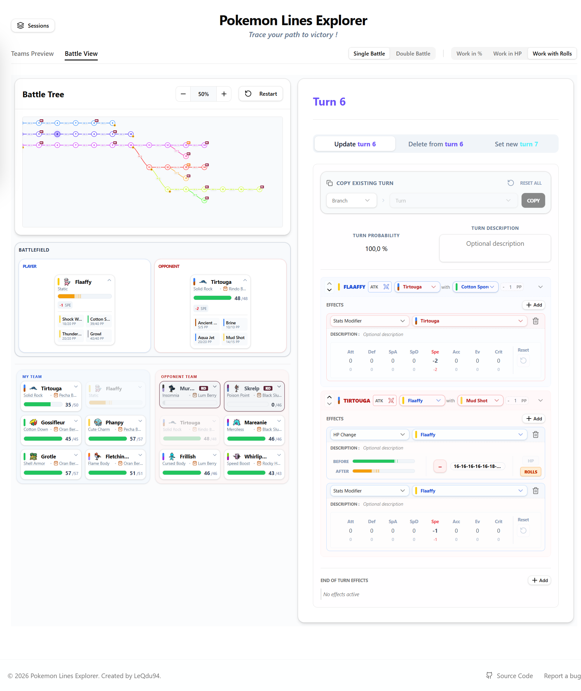

# Pokemon Lines Explorer 🚀

**Pokemon Lines Explorer** is a tool designed to help Pokemon players (especially Nuzlocke players) explore battle lines, simulate scenarios, and plan their strategies with a visual and interactive interface.

🔗 **Try the live site:** [https://pokemon-lines-explorer.fr/](https://pokemon-lines-explorer.fr/)

 *(Add a screenshot here)*

## ✨ Features

- **Interactive Battle Editor**: Simulate battle turns with management of HP, status, and items.
- **Battle Tree**: Visualize different branches of possibilities during a battle.
- **Team Management**: Import and manage your Pokemon and those of your opponents.
- **Double Battle Support**: Manage battles in both single and double modes.
- **"Rolls" Mode**: Handle damage uncertainties with HP ranges.
- **Local Persistence**: Your sessions are saved locally in your browser.

## 🛠 Installation and Development

### Prerequisites

- Node.js (v18 or higher)
- npm

### Local Installation

1. Clone the repository:
   ```bash
   git clone https://github.com/QLauby/pokemon-lines-explorer.git
   cd pokemon-lines-explorer
   ```

2. Install dependencies:
   ```bash
   npm install
   ```

3. Start the development server:
   ```bash
   npm run dev
   ```

The application will be available at `http://localhost:3000`.

### Using with Docker 🐳

If you prefer using Docker, a `docker-compose.yml` file is available:

```bash
docker-compose up --build
```

## 🐛 Bug Reporting and Suggestions

If you find a bug or have suggestions for improvement, please open an **[Issue](https://github.com/QLauby/pokemon-lines-explorer/issues)** on the GitHub repository. This is the best way to track progress and discuss potential fixes.

## 📜 License & Legal

### Code License
This project is licensed under **MIT License**. See the [LICENSE](LICENSE) file for details.

### Legal Disclaimer ⚠️
**Pokemon Lines Explorer** is an unofficial fan project and is NOT affiliated with, endorsed by, or supported by **Nintendo**, **The Pokémon Company**, **Game Freak**, or **Creatures Inc.** 
- All Pokémon names, images, and related media are trademarks and copyrights of their respective owners. 
- This project is created for educational and entertainment purposes under fair use.

## 🙏 Acknowledgments

This project wouldn't be possible without these amazing resources:
- **[Pokémon Showdown](https://github.com/smogon/pokemon-showdown)**: Database and battle logic data ([MIT License](assets/data-pokemonshowdown/LICENSE)).
- **[PokémonDB](https://pokemondb.net/)**: Sprite assets and data references.
- **[PokeSprite](https://github.com/msikma/pokesprite)**: Standardized Pokémon sprite collection.
- **[Smogon University](https://www.smogon.com/)**: Competitive data and mechanics research.

Big thanks to the Smogon community and to all the trainers who test and use this tool!
